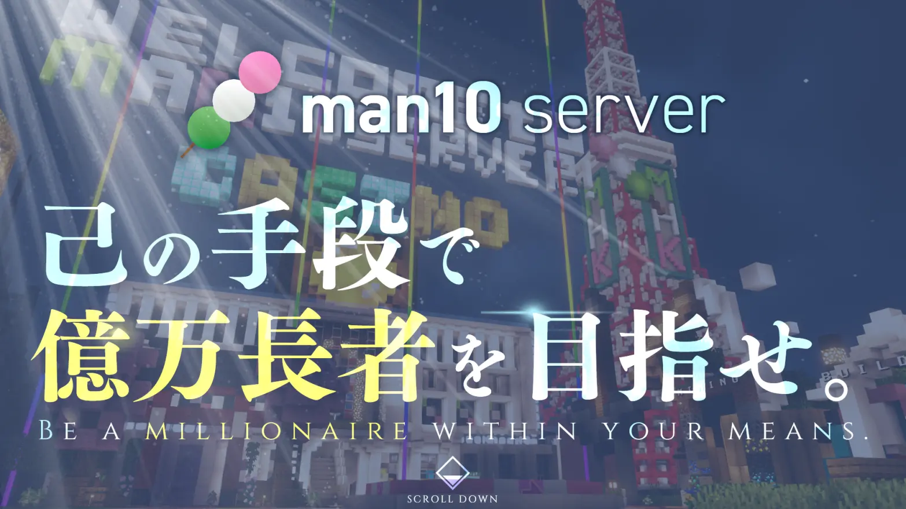

# エンジニアプロフィール

エンジニアとしてのプロフィールです。

## 自己紹介

YUSAMAと申します。MinecraftのプラグインとWebアプリケーションをメインに時々PythonやC#を書いています。コードを書いている歴自体は3年程になります。  
また、実務もしており実務ではRuby on Railsを中心にWebアプリで1年ほど（2025年2月現在）働いています。

## やっていること

私の主なやっていることです

### Minecraftサーバー運営

Man10サーバーというJava版のサーバーでGMとして運営を手伝っています。プラグインの開発やイベントの企画制作など様々なことをしてます。  
Man10サーバーについては[こちら](https://man10.red/)  

### Webアプリ

ちょっとしたWebアプリなら作れます。一応お仕事もさせてもらっています。  
成果物はGitHubに上がっています。以下は主な成果物です。  

[**XrossDiscR3レート戦システム**](https://github.com/yusama125718/r3_web)  
VRChatのゲームワールド「XrossDiscR3」のレート戦を行うためのwebアプリです。  
中身は全てRailsで書き上げています。  

[**Man10運営支援システム**](https://github.com/yusama125718/reward_log)  
Man10サーバーの運営用に報酬のログを残そうと作ったものです。  
使ってないので開発は途中で止まってますが他にも色々機能を入れる予定でした。  
中身は全てRailsで書き上げています。  

[**XrossDiscR4配信レイアウト**](https://github.com/yusama125718/R4NodeCG)  
VRChatのゲームワールド「XrossDiscR4」の配信レイアウトです。
webのダッシュボードからセット数やアビリティの表示ができます。また、トーナメント管理サイトのChallongeとの連携でダッシュボードから直接トーナメントの記録・管理も行えます。  
中身はNodeCGというNode.js系のフレームワークを使用しており、JavaScriptで書き上げています。

### Unity

主にUdon#というVRChat向けのスクリプトでVRChat向けのワールドアセットなどを作成しています。  
ツールは作ったことがありますがゲーム自体は作ったことないです。以下は主な成果物です。  

[**RollJump**](https://github.com/yusama125718/RollJump/settings)  
VRChatで動作するちょっとしたミニゲームです。  
同期周りがうまくいかなくて没になってます。  

[**VRControllerCapture**](https://github.com/yusama125718/VRControllerCapture)  
Unityで作成したSteamVR向けのコントローラ入力表示オーバーレイアプリです。
SteamVRでコントローラー入力した内容が画面に表示されます。結構頑張って作りました。  

## やれる言語・フレームワーク

### Ruby

Ruby on Railsをメインで触っています。一応Jekyllも少し触ったことあります。  
一応仕事でもやっています。  

### Java

Minecraftのプラグイン作成で触っています。歴とリポジトリ数で言えば一番やっている言語です。

### C#

UnityC#がメインです。一応.NETで簡単なコンソールアプリを作ったこともあります。

### Python

簡単なツールやAPIを作るのに使っています。ちょっとした物だったり内部のものだったりが故にGitHubには全くあげていません。  

### JavaScript

フロントエンドとして使うのがほとんどです。バックエンドで使うのはNodeCGくらいでしか使ったことないです。